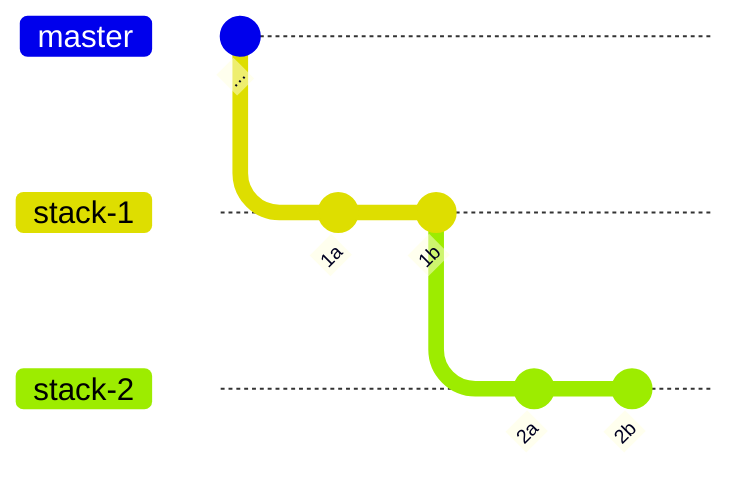
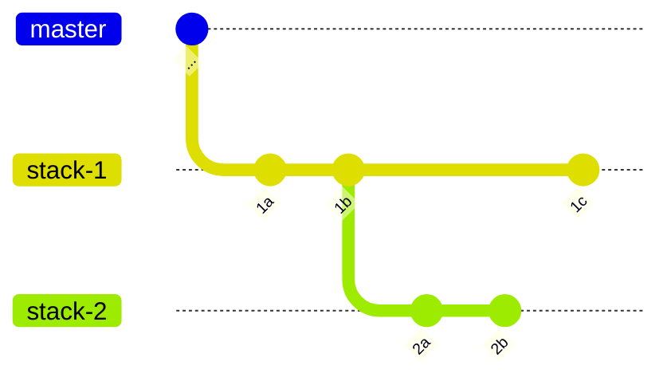
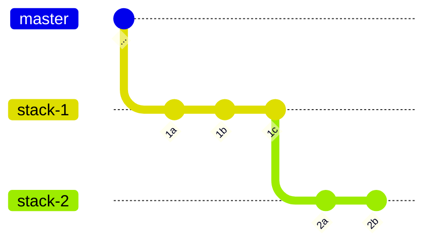

# Add Commits in the Stack

You can create stacked PRs with Aviator CLI and send them for review. Your reviewer might request some code changes in one of the PRs in the middle of the stack. This how-to guide explains how to add a change in such cases.

## Setup

Let's use [Hello-World](https://github.com/octocat/hello-world) repository as an example.

```bash
$ git clone https://github.com/octocat/hello-world hello-world
$ cd hello-world
$ av init
$ touch myfile
$ git add myfile
```

Then, create one branch.

```bash
$ av stack branch stack-1
$ echo 1a >> myfile
$ git commit -m 1a myfile
$ echo 1b >> myfile
$ git commit -m 1b myfile
$ av stack branch stack-2
$ echo 2a >> myfile
$ git commit -m 2a myfile
$ echo 2b >> myfile
$ git commit -m 2b myfile
```

This creates 2 branches.



## Changing the stack-1

We have two branches that correspond to two PRs; `stack-1` and `stack-2`. Let's assume that we need to change the `stack-1`. By running `av stack prev`, you can move back to the previous branch.

```
$ av stack prev
Checked out branch stack-1
```

You can switch the branch with `git switch` or `git checkout` as well.

Now make a necessary change.

```
$ echo 1c >> myfile
$ git commit -m 1c myfile
```

Currently the commit graph is like this:



We want to make `stack-2` to be on top of the new commit 1c. To do this, run `av stack sync`.

```
$ av stack sync
Synchronizing branch stack-1...
  - fetching latest pull request information for stack-1
      - this branch does not have an open pull request (create one with av pr create or av stack submit)
  - branch is a stack root, nothing to do (run av stack sync --trunk to sync against the latest commit in master)


Synchronizing branch stack-2...
  - fetching latest pull request information for stack-2
      - this branch does not have an open pull request (create one with av pr create or av stack submit)
  - synching branch stack-2 on latest commit 6945c77 of parent branch stack-1
  - rebase conflict: could not apply 1b31f3f... 2a
        error: could not apply 1b31f3f... 2a
        Recorded preimage for 'myfile'
        Could not apply 1b31f3f... 2a
  - resolve the conflicts and continue the sync with av stack sync --continue
      - NOTE: do not use the git rebase command directly: use av stack sync instead
```

The file has a rebase conflict. Open `myfile` and resolve the conflict, and continue.

```
$ vim myfile
... Resolving conflict ...
$ git add .
$ av stack sync --continue
Synchronizing branch stack-2...
  - rebased without conflicts
```

Now the `stack-2` is rebased on top of the new commit 1c.



## Convenient CLI commands

When you need to change the commit in the middle of the stack, you almost always need to run `av stack sync` to align the child branches. Aviator CLI has convenient commands, `av commit create` and `av commit amend` that runs `git commit` along with `av stack sync` afterwards.
