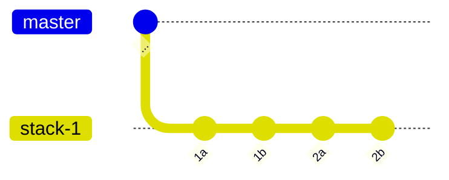
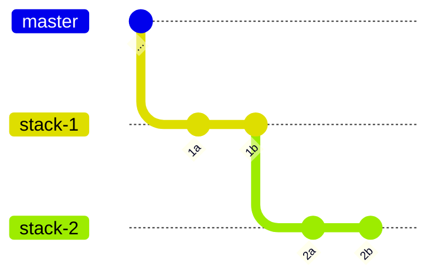

# Split and Fold Pull Requests

Occasionally you might accidentally create a large pull request. In order to do an effective code review, you want to split such large PRs. Aviator CLI allows you to split them.

## Overall Workflow

In Aviator CLI, one branch corresponds to one PR. To split a large pull request, we take two steps:

1. Split a large commit into multiple commits.
2. Reorder and split commits into stacked branches.

By using [<mark style="color:blue;">Split a Commit feature</mark>](splitting-a-commit.md), you can split a large commit into pieces. The guide below walks you through how to reorder and split those commits.

## Setup

Let's use [Hello-World](https://github.com/octocat/hello-world) repository as an example.

```bash
$ git clone https://github.com/octocat/hello-world hello-world
$ cd hello-world
$ av init
$ touch myfile
$ git add myfile
```

Then, create one branch.

```bash
$ av stack branch stack-1
$ echo 1a >> myfile
$ git commit -m 1a myfile
$ echo 1b >> myfile
$ git commit -m 1b myfile
$ echo 2a >> myfile
$ git commit -m 2a myfile
$ echo 2b >> myfile
$ git commit -m 2b myfile
```

This creates 4 commits.



## Split the branch

Run `av stack reorder`. It opens an editor and shows the initial reordering plan.

```
stack-branch stack-1 --trunk master@7fd1a60b01f91b314f59955a4e4d4e80d8edf11d
pick 7329d18  # 1a
pick a89140c  # 1b
pick 4702825  # 2a
pick e875223  # 2b
```

Currently, we have a branch `stack-1`, branched off from `master`. We will move the commit 2a and 2b into `stack-2`. To do this, change the plan into following:

```
stack-branch stack-1 --trunk master@7fd1a60b01f91b314f59955a4e4d4e80d8edf11d
pick 7329d18  # 1a
pick a89140c  # 1b

stack-branch stack-2 --parent stack-1
pick 4702825  # 2a
pick e875223  # 2b
```

Save and close the editor. Aviator CLI picks up the commit 1a and 1b on `stack-1` and picks up the commit 2a and 2b on `stack-2`.

```
Starting branch stack-1 at 7fd1a60
  - applied commit 7329d18 without conflict (HEAD is now at 7329d18)
  - applied commit a89140c without conflict (HEAD is now at a89140c)
Starting branch stack-2 at a89140c
  - applied commit 4702825 without conflict (HEAD is now at 4702825)
  - applied commit e875223 without conflict (HEAD is now at e875223)
Reorder complete!

The stack was reordered successfully.
```

This creates a commit graph like this.



## Fold the branches

The opposite operation is possible as well. Run `av stack reorder` again.

```
stack-branch stack-1 --trunk master@7fd1a60b01f91b314f59955a4e4d4e80d8edf11d
pick 7329d18  # 1a
pick a89140c  # 1b

stack-branch stack-2 --parent stack-1
pick 4702825  # 2a
pick e875223  # 2b
```

Remove `stack-branch stack-2 --parent stack-1`, save, and exit.

```
WARNING: the following branches were removed from the reorder:
  - stack-2

What would you like to do?
    [a] Abort the reorder
    [d] Delete the branches
    [e] Edit the reorder plan
    [o] Orphan the branches (the Git branch will continue to exist but will not
        be tracked by av).

[a/d/e/o]: d
Starting branch stack-1 at 7fd1a60
  - applied commit 7329d18 without conflict (HEAD is now at 7329d18)
  - applied commit a89140c without conflict (HEAD is now at a89140c)
  - applied commit 4702825 without conflict (HEAD is now at 4702825)
  - applied commit e875223 without conflict (HEAD is now at e875223)
Deleted branch stack-2.
Reorder complete!

The stack was reordered successfully.
```

This time, since we removed the branch `stack-2` from the plan, it prompts you what to do with that branch. Since we do not need it anymore, we choose "Delete the branches".

The branch `stack-1` now has the commit 1a through 2b.
