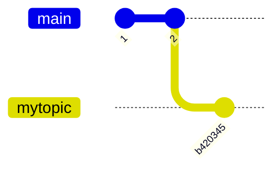
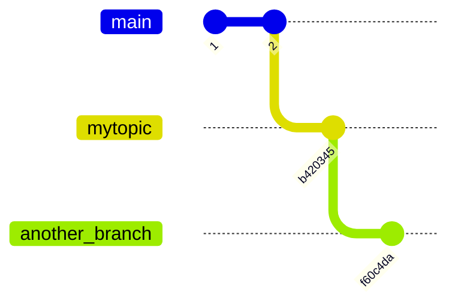
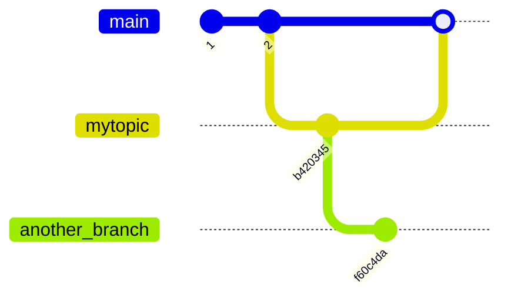

# Quickstart

This page explains how to use Aviator CLI to drive day-to-day development.

## Before you begin

1. [<mark style="color:blue;">Install Aviator CLI</mark>](installation.md)
2. [<mark style="color:blue;">Set up GitHub Personal Access Token</mark>](configuration.md#github-personal-access-token)
3. Clone your repository locally

## Initialize your repository with Aviator CLI

Run `av init` inside your repository. You need to do this only once per your local clone.

```
$ av init
Successfully initialized repository for use with av!
```

## Create a topic branch

Create a branch with `av stack branch BRANCH_NAME` from `main`.

```
$ git switch main
Already on 'main'
Your branch is up to date with 'origin/main'.
$ av stack branch mytopic
$ echo "Some changes" > testfile
$ git add .
$ git commit -m "Add a new file"
[mytopic b420345] Add a new file
 1 file changed, 1 insertion(+)
 create mode 100644 testfile
```

The topic branch `mytopic` is intended to be merged to `main` later. If you want to use other branch as the merge destination, checkout that branch first.



## Create a pull-request

Create a pull-request with `av pr create`. It shows an editor for the pull-request description. Every time you update your local branch, you can run this to update the pull-request.

```
$ av pr create
Creating pull request for branch mytopic:
  - pushing to origin/mytopic
  - created pull request https://github.com/yourname/yourrepo/pull/16
```

## Stack a new topic branch

Create a new topic branch on top of the current topic branch with `av stack branch`.

```
$ av stack branch another_topic
```

You can see the stack with `av stack tree`.

```
$ av stack tree
  * another_topic (HEAD, need sync)
  │ No pull request
  │
  * mytopic
  │ https://github.com/yourname/yourrepo/pull/16
  │
  * main
```

Add more changes to the branch.

```
$ echo "More changes" > newfile
$ git add .
$ git commit -m "Add another file"
[another_topic f60c4da] Add another file
 1 file changed, 1 insertion(+)
 create mode 100644 newfile
```



## Create a second pull-request

The second pull-request can be created with `av pr create` now.

```
$ av pr create
Creating pull request for branch another_topic:
  - pushing to origin/another_topic
  - created pull request https://github.com/yourname/yourrepo/pull/17
```

You can see the pull-request URLs with `av stack tree`.

```
$ av stack tree
  * another_topic (HEAD)
  │ https://github.com/yourname/yourrepo/pull/17
  │
  * mytopic
  │ https://github.com/yourname/yourrepo/pull/16
  │
  * main
```

The first pull-request is targeting the `main` branch. And the second pull-request is targeting the first pull-request branch.

This will be updated once you merge the first pull-request.

## Merge and sync the pull-requests

Let's merge the first pull-request now. We merge the first pull-request and keep the second pull-request open.



After this, we want to make the second one to be rebased on top of the newly updated `main` branch. To do this, we run `av stack sync`.

```
$ av stack sync

  ✓ GitHub fetch is done
  ✓ Restack is done

    * ✓ another_topic e808923
    │
    │ * mytopic (merged) 6d19ed1
    ├─┘
    * main ba8eefe

  Confirming the push to GitHub

    Following branches do not need a push.

      mytopic: PR is already merged.

    Following branches need to be pushed.

      another_topic
        Remote: cb51296 Add another file 2024-06-25 13:01:45 -0700 -0700 (1 minute ago)
        Local:  e808923 Add another file 2024-06-25 13:03:07 -0700 -0700 (10 seconds ago)
        PR:     https://github.com/yourname/yourrepo/pull/17

  Are you OK with pushing these branches to remote?
    ▸ Yes. Push the branches to GitHub.
      No. Do not push the branches to GitHub.
  ↑/k move up • ↓/j move down • space/enter select • ctrl+c cancel

```

It fetches the latest `main` from the remote, rebase the second branch on top of it. Choose to push to the remote.

```
$ av stack sync

  ✓ GitHub fetch is done
  ✓ Restack is done

    * ✓ another_topic e808923
    │
    │ * mytopic (merged) 6d19ed1
    ├─┘
    * main ba8eefe

  ✓ Pushed to GitHub

    Following branches do not need a push.

      mytopic: PR is already merged.

    Following branches are pushed.

      another_topic
        Remote: cb51296 Add another file 2024-06-25 13:01:45 -0700 -0700 (2 minutes ago)
        Local:  e808923 Add another file 2024-06-25 13:03:07 -0700 -0700 (1 minute ago)
        PR:     https://github.com/yourname/yourrepo/pull/17

  Confirming the deletion of merged branches

    Following merged branches can be deleted.

      mytopic: 6d19ed1f0019d0f59b65177ef7a4f358c278baec

  Are you OK with deleting these merged branches?
    ▸ Yes. Delete these merged branches.
      No. Do not delete the merged branches.
  ↑/k move up • ↓/j move down • space/enter select • ctrl+c cancel

```

Since the first branch is already merged, it asks you if you want to delete the local branch. Choose yes to delete the merged branch.

&#x20;If you run `av stack tree`, you can see that the second branch now has `main` as the parent.

```
$ av stack tree
  * another_topic
  │ https://github.com/yourname/yourrepo/pull/17
  │
  * main (HEAD)
```

## What's next

* [<mark style="color:blue;">Learn how to add Aviator CLI commands as a Git subcommand</mark>](how-to-guides/git-subcommand-aliasing.md)
* [<mark style="color:blue;">Learn how to adopt a branch created from Git command</mark>](how-to-guides/adopt-a-branch.md)
