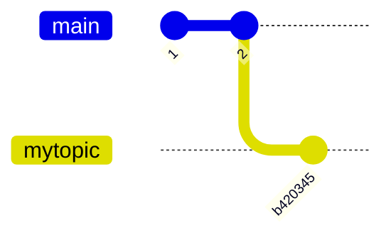
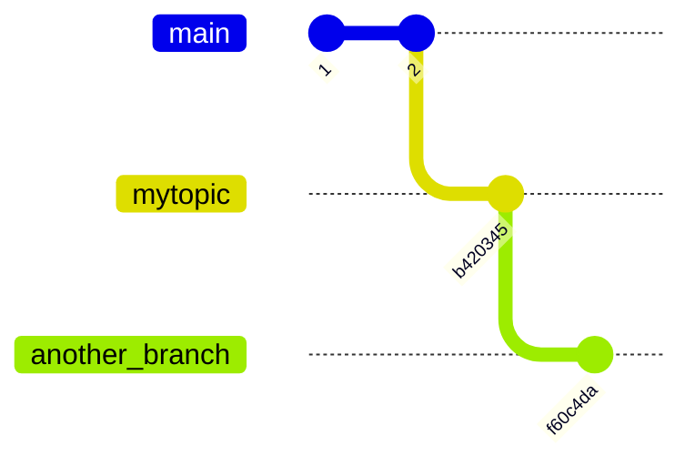
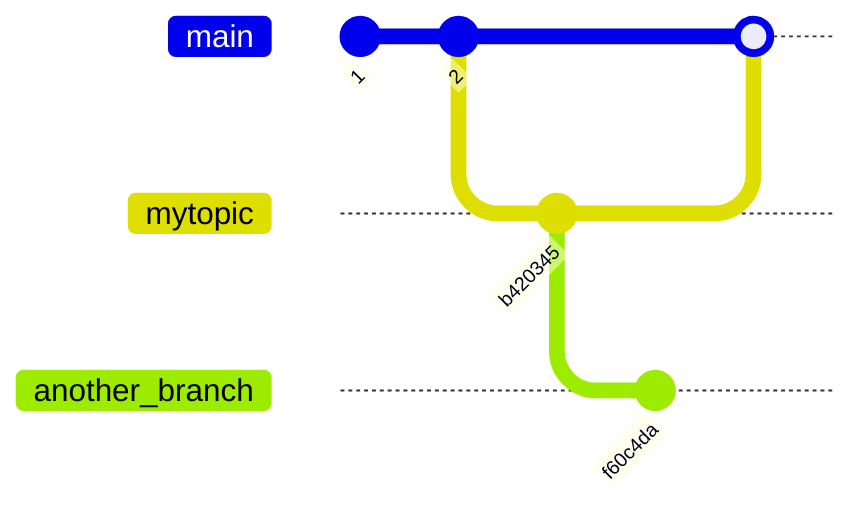
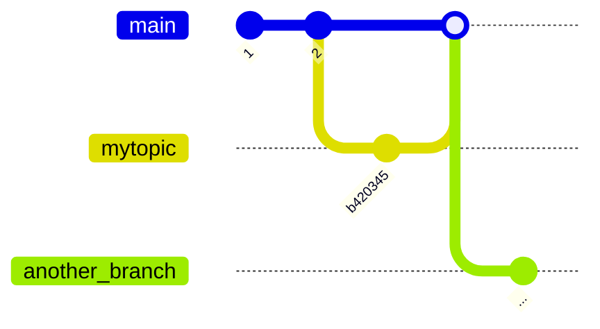

# Quickstart

This page explains how to use Aviator CLI to drive day-to-day development.

## Before you begin

1. [Install Aviator CLI](installation.md)
2. [Set up GitHub Personal Access Token](configuration.md#github-personal-access-token)
3. Clone your repository locally

## Initialize your repository with Aviator CLI

Run `av init` inside your repository. You need to do this only once per your local clone.

```
$ av init
Successfully initialized repository for use with av!
```

## Create a topic branch

Create a branch with `av stack branch BRANCH_NAME` from `main`.

```
$ git switch main
Already on 'main'
Your branch is up to date with 'origin/main'.
$ av stack branch mytopic
$ echo "Some changes" > testfile
$ git add .
$ git commit -m "Add a new file"
[mytopic b420345] Add a new file
 1 file changed, 1 insertion(+)
 create mode 100644 testfile
```

The topic branch `mytopic` is intended to be merged to `main` later. If you want to use other branch as the merge destination, checkout that branch first.



## Create a pull-request

Create a pull-request with `av pr create`. It shows an editor for the pull-request description. Every time you update your local branch, you can run this to update the pull-request.

```
$ av pr create
Creating pull request for branch mytopic:
  - pushing to origin/mytopic
  - created pull request https://github.com/yourname/yourrepo/pull/16
```

## Stack a new topic branch

Create a new topic branch on top of the current topic branch with `av stack branch`.

```
$ av stack branch another_topic
```

You can see the stack with `av stack tree`.

```
$ av stack tree
main
    mytopic https://github.com/yourname/yourrepo/pull/16 
        * another_topic (not pushed)
```

Add more changes to the branch.

```
$ echo "More changes" > newfile
$ git add .
$ git commit -m "Add another file"
[another_topic f60c4da] Add another file
 1 file changed, 1 insertion(+)
 create mode 100644 newfile
```



## Create a second pull-request

The second pull-request can be created with `av pr create` now.

```
$ av pr create
Creating pull request for branch another_topic:
  - pushing to origin/another_topic
  - created pull request https://github.com/yourname/yourrepo/pull/17
```

You can see the pull-request URLs with `av stack tree`.

```
$ av stack tree
main
    mytopic https://github.com/yourname/yourrepo/pull/16 
        * another_topic https://github.com/yourname/yourrepo/pull/17 
```

The first pull-request is targeting the `main` branch. And the second pull-request is targeting the first pull-request branch.

This will be updated once you merge the first pull-request.

## Merge and sync the pull-requests

Let's merge the first pull-request now. We merge the first pull-request and keep the second pull-request open.



After this, we want to make the second one to be rebased on top of the newly updated `main` branch. To do this, we run `av stack sync --trunk`.

```
$ av stack sync --trunk
Synchronizing branch mytopic...
  - fetching latest pull request information for mytopic
  - skipping sync for merged branch (merged in commit e216f2a)


Synchronizing branch another_topic...
  - fetching latest pull request information for another_topic
  - fetching latest commit from origin/main
  - rebased without conflicts
  - this branch is now a stack root based on trunk branch main
  - pushing another_topic... okay

```

With `--trunk` option, it fetches the latest `main` from the remote, rebase the second branch on top of it. If you run `av stack tree`, you can see that the second branch now has `main` as the parent.

```
$ av stack tree
main
    * another_topic https://github.com/yourname/yourrepo/pull/17 
    mytopic https://github.com/yourname/yourrepo/pull/16
```



We can remove the local branch `mytopic` and remove the metadata from `av`.

```
$ git branch --delete mytopic
Deleted branch mytopic (was b420345).
$ av stack tidy
Tidied 1 branch.
$ av stack tree
main
    * another_topic https://github.com/yourname/yourrepo/pull/17
```

## What's next

* [Learn how to add Aviator CLI commands as a Git subcommand](git-subcommand-aliasing.md)
