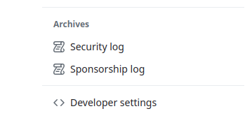

# Chrome Extension

You can use [<mark style="color:blue;">Aviator's Chrome Extension</mark>](https://chrome.google.com/webstore/detail/aviator-chrome-extension/inoabloekooadaolcncfmpgafkgbgnif) to enqueue your pull-request from GitHub.

## Installation

Install from [<mark style="color:blue;">Chrome Web Store</mark>](https://chrome.google.com/webstore/detail/aviator-chrome-extension/inoabloekooadaolcncfmpgafkgbgnif). After the installation, open your pull-request, and you can find a log-in button instead of the GitHub merge button.

<figure><figcaption></figcaption></figure>

Click the login button, and you'll redirected to the Aviator login page. If you are already logged in, it should automatically get back to the original PR page.

## How to use

If the repository is configured with Aviator MergeQueue, it shows a button to enqueue a pull request. This will work properly with stacked PRs as well.

<figure><figcaption>
Enqueue an open PR
</figcaption></figure>

Once the PR has entered the queue, the extension will show information about the bot pull request, and a timeline of the PR's activity. If the queue is currently paused, the extension will notify the user, regardless of the PR's status.

<figure><figcaption>
PR in the merge queue
</figcaption></figure>

The extension will show updated information if the PR is blocked.

<figure><figcaption>
Blocked PR
</figcaption></figure>

If you need, there is an option to show the original GitHub merge button.

## Use with Aviator MergeQueue on-prem

You can open the extension option page from the extension menu.

<figure><figcaption></figcaption></figure>

You can specify your on-prem Aviator deployment URL.

<figure><figcaption></figcaption></figure>
