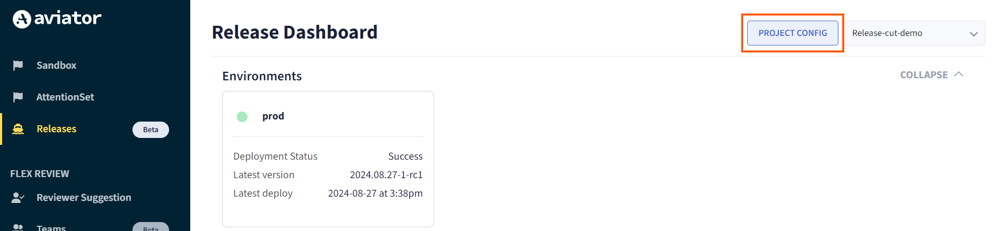
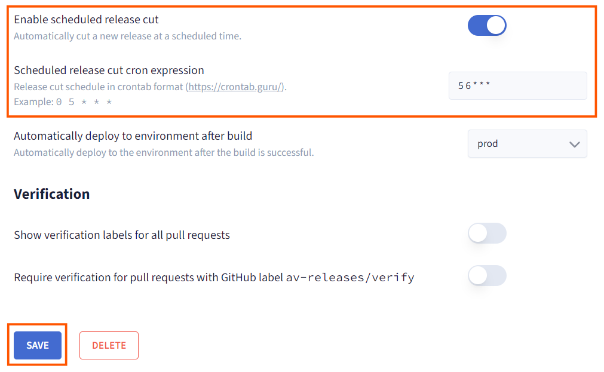
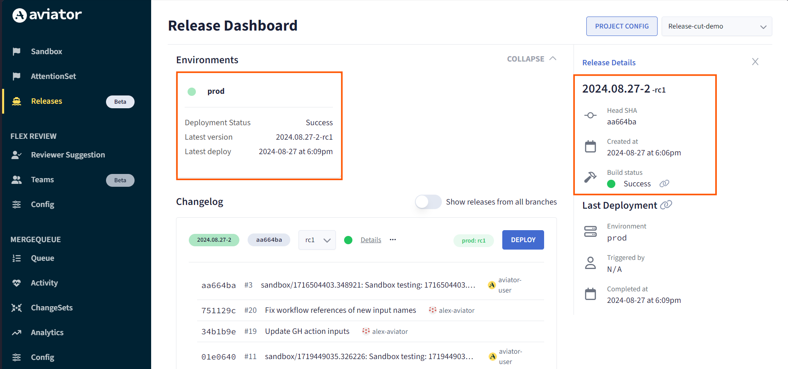

# Create a Scheduled Release

Scheduling a release means setting up an automated process that triggers the creation of a new version of your software at specific times or intervals. Instead of manually deciding when to create a new version (release), you just define a cron expression of the schedule, and Aviator handles it automatically.

## Enable Scheduled Release Cut and Define the Schedule

1. Go to the **Project Config** to enable scheduling for the release project.

2. Scroll down to find the **Enable scheduled release cut** option.
3. Toggle the button to enable scheduling if it’s not already enabled.
4. Add a cron expression to specify when the release cuts should occur.  
**Note:** This is a standard Unix cron expression that operates in the UTC timezone. You can refer to the cron expression format [here](https://crontab.guru/).
5. Save the configuration after adding the cron expression.

## Verify the Release Cut

1. Ensure that the release cut occurs successfully at the scheduled time.
2. Check the release details to confirm that the release was created as expected.
3. If configured, an automated deployment of an environment will also be triggered after the successful build.

## FAQ

### What happens if there are no new commits since the last release cut version?

If there are no new commits since the last release cut version, the release cut will be skipped. This ensures that only meaningful changes trigger a new release, avoiding unnecessary builds and deployments.