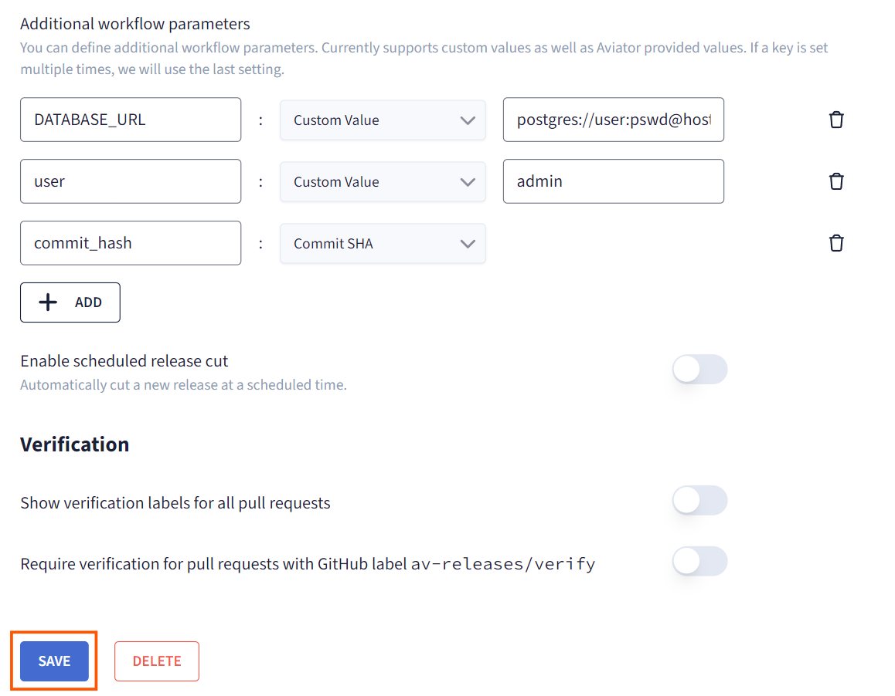

# Create Custom Environment Variables

Custom environment variables allow you to define and manage key-value pairs that can be accessed during your software build and deployment process. This ensures that your release pipeline can use specific configurations for different environments.

## Generate Custom Variables in Your Project Config

1. Go to the Project Config in your Aviator release project.
2. In the build section, fetch and select your workflow.

3. In the "Additional workflow parameters", click "ADD" button to define a new environment variable.
4. Enter the key (name of the variable) and the value. Instead of a custom value, you can also select a pre-defined value from the dropdown.
   - **Key**: This should be a unique identifier for the variable (e.g., DATABASE_URL).
   - **Value**: This is the specific configuration or secret (e.g., the actual database connection string).
5. After adding all necessary variables, click Save to store the configurations.


## Add the Custom Environment Variables to your Workflow

1. Go to your CI/CD workflow (GitHub Actions in this case).
2. Add the variables as inputs on workflow dispatch.
```yaml
name: build
on:
  workflow_dispatch:
    inputs:
      DATABASE_URL:
          description: "Database Connection String"
          required: false
          type: string
      user:
          description: "Username"
          required: false
          type: string
      commit_hash:
        description: "Commit hash"
        required: false
        type: string
```
3. Create a job which prints these inputs.
```yaml
jobs:
  build:
    runs-on: ubuntu-latest
    steps:
      - name: Print the inputs
        run: |
          echo "Inputs:"
          echo "DATABASE_URL=${{ inputs.DATABASE_URL }}"
          echo "user=${{ inputs.user }}"
          echo "commit_hash=${{ inputs.commit_hash }}"
```
4. On the release dashboard, cut a release to trigger the workflow.

5. Verify the logs of the triggered pipeline to get the value of the custom environment variables in the workflow.


