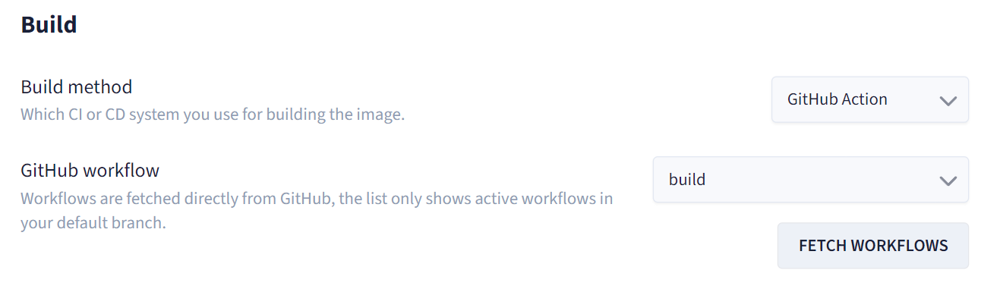
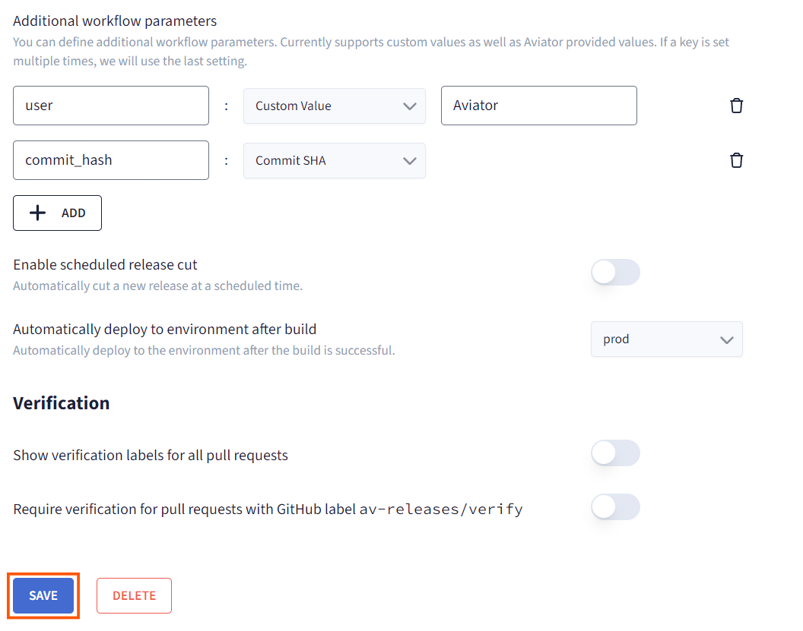
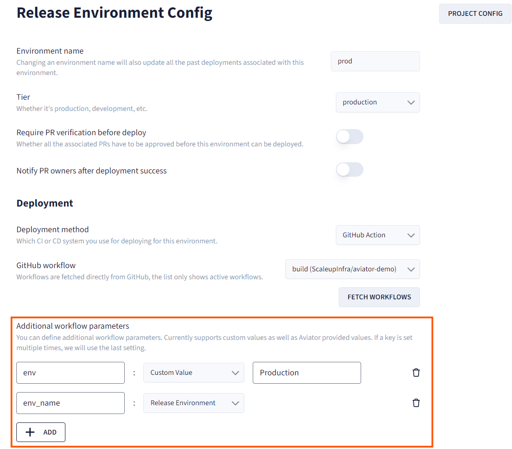
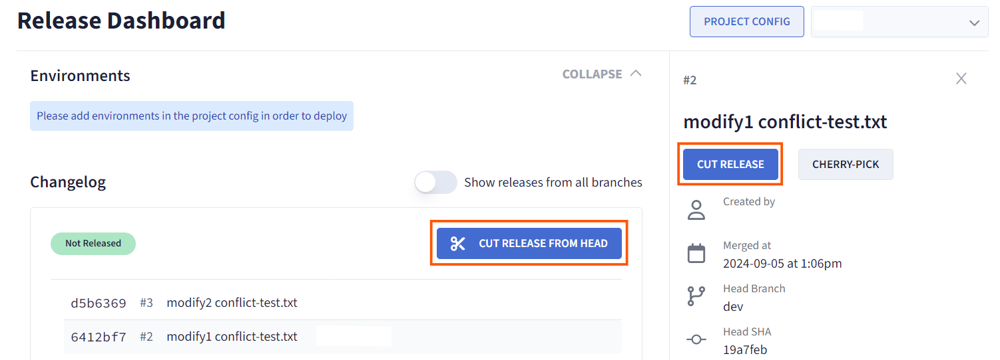
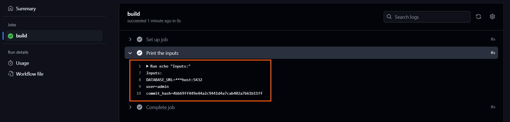

# Create Custom Workflow Parameters

Custom workflow parameters allow you to define and manage key-value pairs that can be accessed during your software build and deployment process. This ensures that your release pipeline can use specific configurations for different environments, such as staging, production, or custom setups.

## Setting Workflow Parameters for Your Build Workflow

1. Go to the Project Config in your Aviator release project.
2. In the build section, fetch and select your workflow.

3. In the "Additional workflow parameters", click "ADD" button to define a new workflow parameter.
4. Enter the key (name of the variable) and the value. Instead of a custom value, you can also select a pre-defined value from the dropdown.
   - **Key**: This should be a unique identifier for the variable (e.g., user).
   - **Value**: This is the specific configuration or secret (e.g., Aviator).
5. After adding all necessary variables, click Save to store the configurations.


## Setting Workflow Parameters for Your Deploy Workflow

1. Navigate to the **Environment Config** for the environment where you'd like to apply custom workflow parameters (e.g., staging or production).
   - **Note:** If you haven't created any environment yet, go to your **Project Config** and click on **"Add Environment"** to create one.
2. In the **"Additional workflow parameters"** section, click the **"ADD"** button to define the key and value for this environment.
3. Save the changes to apply the parameters specific to that environment.




## Add the Custom Workflow Parameters to your Pipeline

1. Go to your CI/CD workflow (GitHub Actions in this case).
2. Add the variables as inputs on workflow dispatch.
```yaml
name: build
on:
  workflow_dispatch:
    inputs:
      user:
        description: "Username"
        required: false
        type: string
      commit_hash:
        description: "Commit hash"
        required: false
        type: string
      env_name:
        description: "Environment name"
        required: false
        type: string
```
3. Create a job which prints these inputs.
```yaml
jobs:
  build:
    runs-on: ubuntu-latest
    steps:
      - name: Print the inputs
        run: |
          echo "Inputs:"
          echo "user=${{ inputs.user }}"
          echo "commit_hash=${{ inputs.commit_hash }}"
          echo "env_name=${{ inputs.env_name }}"
```
4. On the release dashboard, cut a release to trigger the workflow.

5. Verify the logs of the triggered pipeline to get the value of the custom workflow parameters in the workflow.


