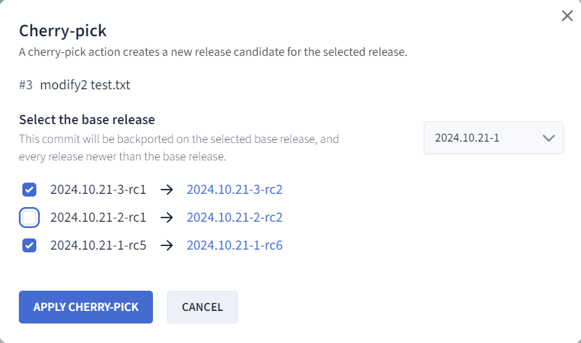
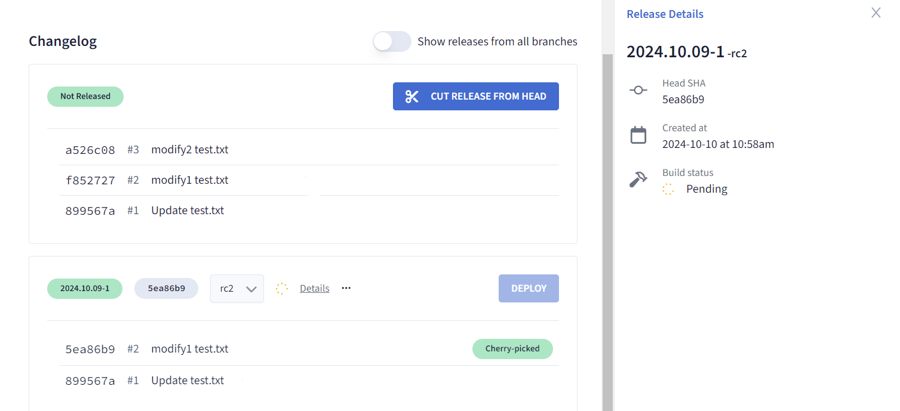
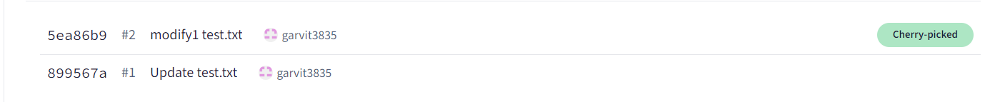
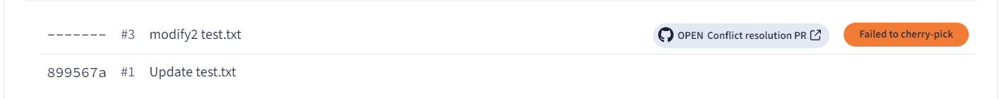

# Managing Cherry-Picks

Cherry-picking enables you to apply specific commits from one branch to another without merging the entire branch. In Aviator’s release management system, cherry-picks are used to selectively integrate changes into release candidates. This guide will walk you through the process of managing cherry-picks in Aviator, ensuring smooth handling of your release process.

## Prerequisites

Before you begin cherry-picking, ensure that your repository is properly connected to Aviator and that a release project has been created. Refer the guide [here](../getting-started.md) to know more about release projects.

1. Set up your repository and connect it to Aviator.

2. [Create a release project](./creating-a-release-project.md) if it does not already exist.

## Cherry-Picking a Pull Request (PR)

### Step 1: Cut a New Release

1. Open Aviator’s Release Dashboard.

2. Cut a release from the listed PRs on the dashboard.

Note: You can skip this step if you already have an existing release to base the cherry-pick on, as this is the release where you will apply the cherry-pick.

### Step 2: Cherry-Pick the PR

1. Find the specific PR you wish to cherry-pick into your release.

2. Click on the PR to open the detailed view.

3. Click the "Cherry-pick" button in the PR details view.

4. Click the button to initiate the cherry-pick process. Aviator will apply the changes from the PR into the selected release candidate in the dropdown. It may take a few seconds to apply the cherry-pick.

5. Aviator enables users to apply the same PR to multiple release candidates. You can select the oldest release version, and Aviator will apply the cherry-pick to all versions newer than that. 

6. Users can also deselect the versions they don't want to apply cherry-picks to. Aviator will automatically detect which versions already include this PR and skip the cherry-pick for those versions.

7. During the cherry-pick process, Aviator will display the current status of the operation. It may take a few seconds for the cherry-pick to be applied, and the status will indicate the progress:

    - **Pending**: The cherry-pick is in progress.
  

    - **Success**: The cherry-pick has been successfully applied, and a new release candidate has been created.
  

    - **Failure**: The cherry-pick failed due to conflicts, and Aviator will provide options to resolve the issue.
  

7. If the cherry-pick is successful, a second release candidate of the release will be created.

## Cherry-Pick Failures

In some cases, a cherry-pick may fail due to conflicts between the changes in the PR and the current state of the release branch. Aviator will flag such conflicts and provide tools to help resolve them. To learn how to resolve cherry-pick failures, refer to the detailed guide on [Resolving Cherry-Pick Failures](./resolving-a-cherry-pick-failure.md).

