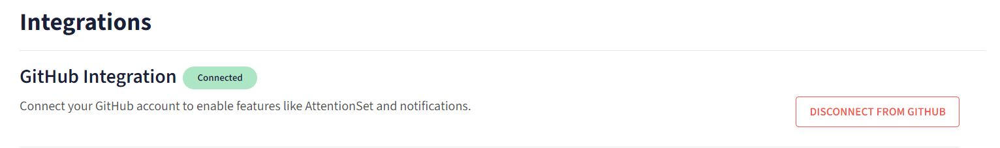
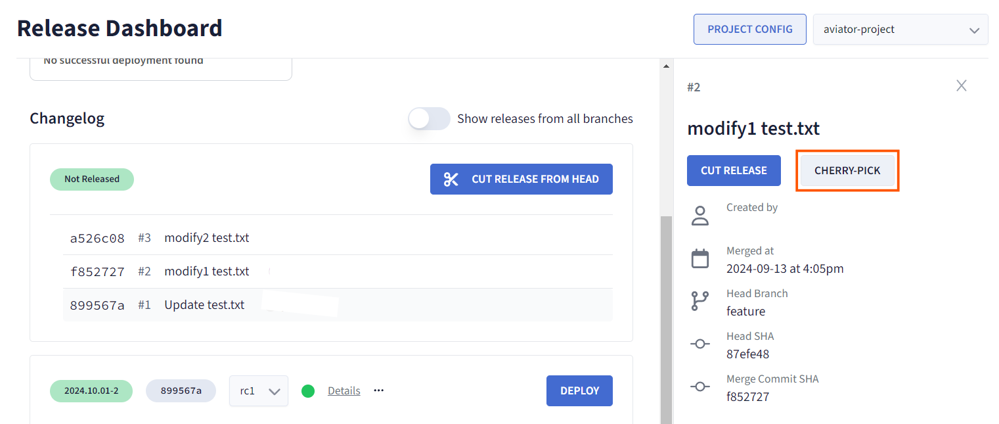
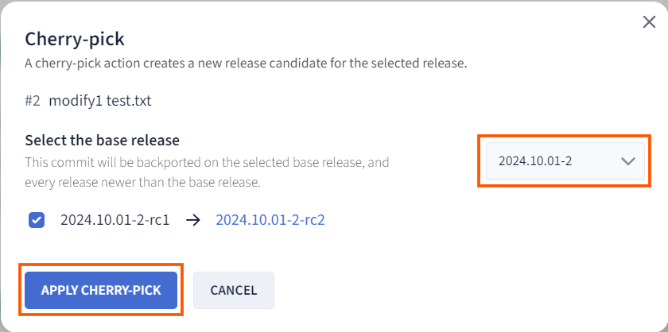

# Managing Cherry-Picks

Cherry-picking is an essential tool in version control systems, allowing you to apply specific commits from one branch to another without merging the entire branch. In Aviator’s release management system, cherry-picks are used to selectively integrate changes into release candidates. This guide will walk you through the process of managing cherry-picks in Aviator, ensuring smooth handling of your release process.

## Prerequisites

Before you begin cherry-picking, ensure that your repository is properly connected to Aviator and that a release project has been created.

1. Set up your repository and connect it to Aviator.

2. [Create a release project](./creating-a-release-project.md) if it does not already exist.

## Cherry-Picking a Pull Request (PR)

### Step 1: Navigate to the Aviator Release Dashboard

1. Open Aviator’s Release Dashboard.

2. Cut a release from the listed PRs on the dashboard.

### Step 2: Cherry-Pick the PR

1. Find the specific PR you wish to cherry-pick into your release.

2. Click on the PR to open the detailed view.

3. Once inside the PR details, locate the Cherry-Pick button.

2. Click the button to initiate the cherry-pick process. Aviator will apply the changes from the PR into the selected release candidate in the dropdown.

3. If the cherry-pick is successful, a second release candidate of the release will be created.

## Cherry-Pick Failures

In some cases, a cherry-pick may fail due to conflicts between the changes in the PR and the current state of the release branch. Aviator will flag such conflicts and provide tools to help resolve them.

To learn how to resolve cherry-pick failures, refer to the detailed guide on [Resolving Cherry-Pick Failures](./resolving-a-cherry-pick-failure.md).