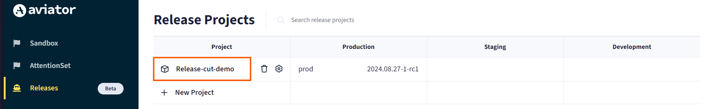
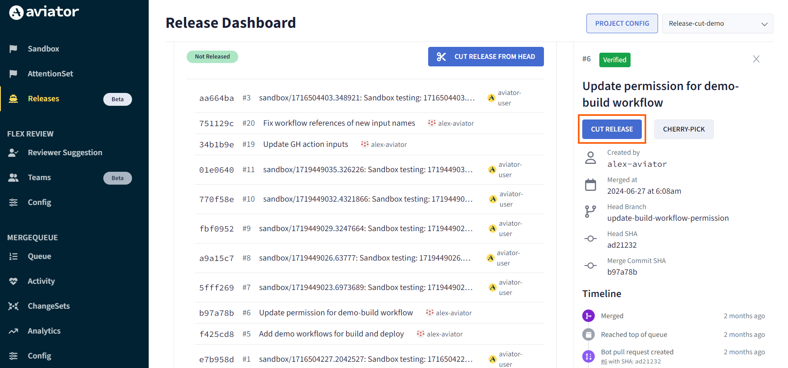

# Scheduling a Release Cut

## Creating a Release Cut

If you're working on a software project with multiple developers making changes then at some point, you want to take all the latest changes and create a new version of your software, like saving a specific version of a document that you're working on. This saved version, or "release," is something you can give to others to use or put into production.

### Access the Project Dashboard

1. Go to the **Releases** section in Aviator.
2. Click on the project name to open its Dashboard.

### Cut a Release from the Latest Code

To create a new release based on the latest code in the branch:

1. Click on the **CUT RELEASE FROM HEAD** button.
2. This will create a release using the latest changes in the branch.

### Cut a Release up to a Specific Merge

If you need to create a release up to a certain merge:

1. Click on the specific merge in the project's commit history.
2. In the right panel, click on **CUT RELEASE**.
3. This will create a release that includes all changes up to the selected merge commit.

## Scheduling a Release Cut

Scheduling a release cut means setting up an automated process that triggers the creation of a new version of your software at specific times or intervals. Instead of manually deciding when to create a new version (release), you just define a cron expression of the schedule, and Aviator handles it automatically.

### Enable Scheduled Release Cut and Define the Schedule

1. Go to the **Project Config** to enable scheduling for the release project.

2. Scroll down to find the **Enable scheduled release cut** option.
3. Toggle the button to enable scheduling if it’s not already enabled.
4. Add a cron expression to specify when the release cuts should occur.
   - You can refer to the cron expression format [here](https://crontab.guru/).
5. Save the configuration after adding the cron expression.

### Verify the Release Cut

1. Ensure that the release cut occurs successfully at the scheduled time.
2. Check the release details to confirm that the release was created as expected.

