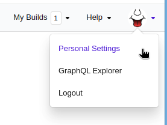

# Buildkite workflow

Use this guide to configure Buildkite build and deploy steps to manage releases in Aviator. To use Aviator Releases, we recommend having separate steps for the build and deploy workflows. You may still use it as a single step, in which case the creation of Release (the build part) will be a no-op.

## Authentication

Buildkite doesn’t have a concept of Apps or bot accounts. Because of this, we need to take an access token for a user.

**Step 1**: Go to “Personal Settings” from the top-right corner

<figure><figcaption></figcaption></figure>

**Step 2**: Click “API Access Tokens”

<figure><figcaption></figcaption></figure>

**Step 3**: Click “New API Access Token”

Name the token and pick your organization

<figure><figcaption></figcaption></figure>

Choose “**Read Builds**”, “**Write Builds**”, and “**Read Pipelines”**.

<figure><figcaption></figcaption></figure>

Click “Create New API Access Token”

**Step 4**: Copy the created access token, and go to [https://app.aviator.co/settings/workspace/integrations](https://app.aviator.co/settings/workspace/integrations), paste the created access token to the Buildkite integration.

<figure><figcaption></figcaption></figure>

## 2. Setup Buildkite Webhook

Go to your Buildkite organization’s settings from the top bar.

<figure><figcaption></figcaption></figure>

Go to “Notification Services”

<figure><figcaption></figcaption></figure>

Add “Webhook”

<figure><figcaption></figcaption></figure>

Name this webhook and put [`https://app.aviator.co/api/buildkite/webhook`](https://app.aviator.co/api/buildkite/webhook) to the webhook URL.

<figure><figcaption></figcaption></figure>

Choose “build.schedules”, “build.running”, “build.failing”, and “build.finished”.

<figure><figcaption></figcaption></figure>

Click “Add Webhook Notification”.

## Build workflow

### Option A - Using Two-step workflow

#### Connecting with Aviator

On Buildkite pipeline page, copy the pipeline’s URL

<figure><figcaption></figcaption></figure>

Go to the release project config for the build pipeline configuration. Choose Buildkite and paste the organization and pipeline names as shown in the copied URL.

<figure><figcaption>
Buildkite Organization and Pipeline slug
</figcaption></figure>

Click “SAVE”.

#### Using Environment variables

Aviator sends the following parameters to Buildkite as environment variables when triggering the workflow:

`AVIATOR_RELEASE_CUT_ID` - Aviator’s internal database ID associated with the Release.

`AVIATOR_RELEASE_CANDIDATE_VERSION` - A unique version string tied to the Release Candidate. This can be used to tag the built artifacts.

`AVIATOR_RELEASE_CUT_COMMIT_HASH` - commit SHA associated with the release candidate version. You should checkout this commit SHA in the build pipeline to trigger the workflow.

### Option B - Skipping build step

If you want to skip the Build step entirely, select “Not Configured” in the Build step:

<figure><figcaption>
Skip the build step
</figcaption></figure>

In this configuration mode, as soon as a Release is cut, the build is marked as completed. Then you can set up deployment as a separate step.

## Deploy workflow

#### Connecting with Aviator

Similar to the Build step, copy the Organization Slug and Pipeline slug in the Deploy environment configuration:

<figure><figcaption>
Deployment configuration for Buildkite
</figcaption></figure>

#### Using Environment variables

Aviator sends the following parameters to Buildkite as environment variables when triggering the workflow:

`AVIATOR_DEPLOYMENT_ID` - Aviator’s internal database ID associated with the Deployment.

`AVIATOR_RELEASE_CANDIDATE_VERSION` - A unique version string tied to the Release Candidate. This can be used to tag the built artifacts.

`AVIATOR_RELEASE_CUT_COMMIT_HASH` - commit SHA associated with the release candidate version. You should checkout this commit SHA in the build pipeline to trigger the workflow.

Now you should be ready to use Aviator Release Management!
