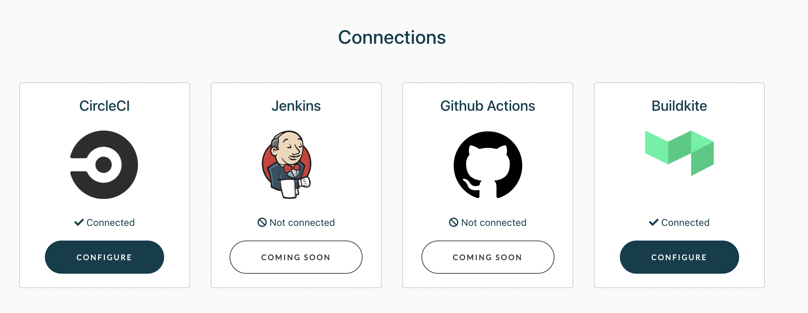

# Auto rerun tests

Currently, rerunning flaky tests is supported in the `pytest` framework - see plugin [<mark style="color:blue;">here</mark>](https://github.com/aviator-co/pytest-aviator).

### Installation

**Step 1**: Install the plugin in your repository using pip or poetry:

```
pip install pytest-aviator
```

**Step 2**: Set your account's Aviator API token as an environment variable AVIATOR\_API\_TOKEN.

That’s it. Now when you run the tests using `pytest`, the plugin will automatically identify all flaky tests by querying the Aviator APIs and rerun depending on the configuration set in TestDeck.

## Add CI connections

Connect to your CI provider on the `Connections` page. We currently support CircleCI and Buildkite. You will need the provider API token in order for TestDeck to communicate with the provider. The instructions to generate API token can be count on the configuration page for the respective CI.

* [<mark style="color:blue;">CircleCI API Tokens</mark>](https://circleci.com/docs/managing-api-tokens)
* [<mark style="color:blue;">Buildkite API Tokens</mark>](https://buildkite.com/docs/apis/managing-api-tokens)

<figure><figcaption></figcaption></figure>

